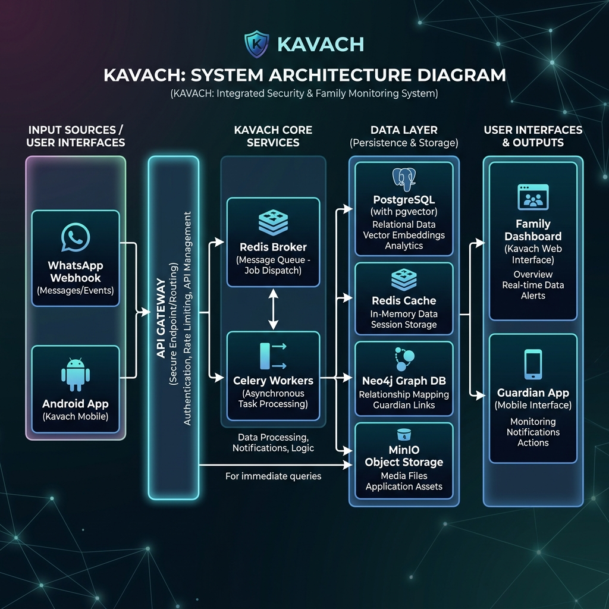
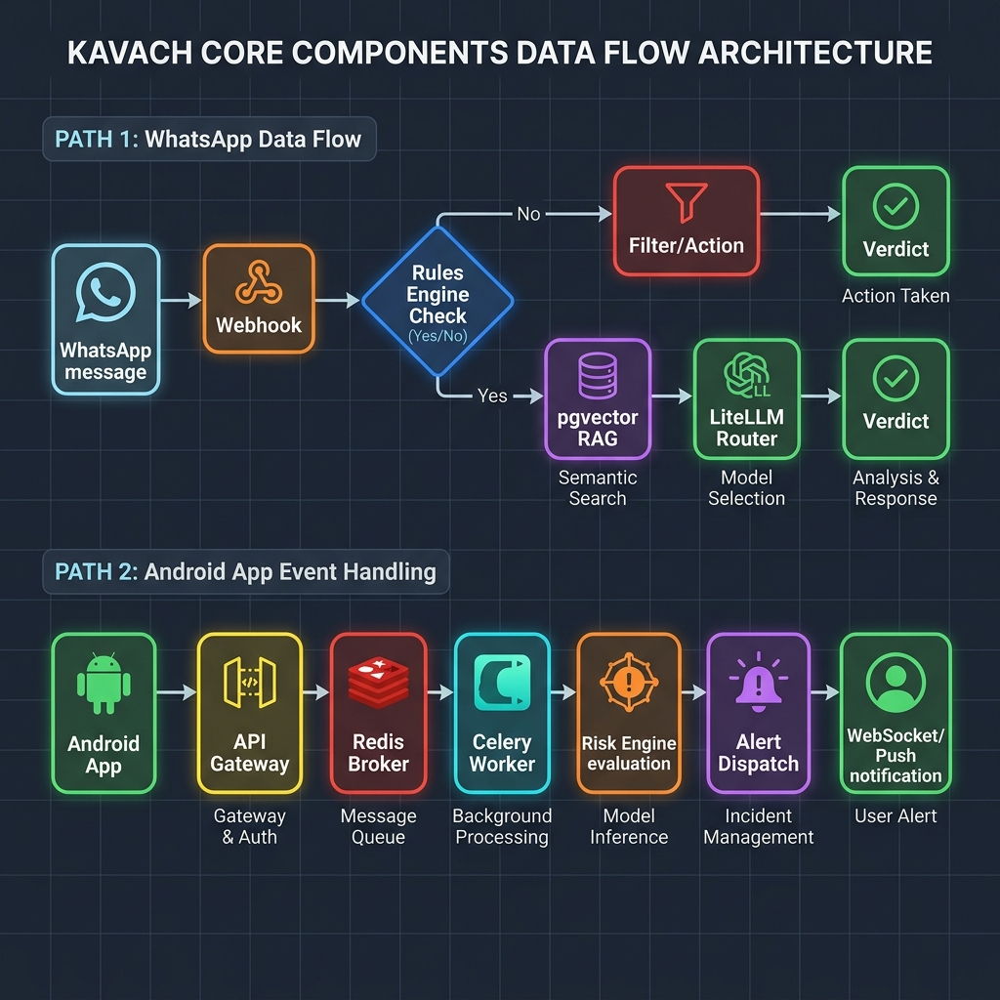

# KAVACH BACKEND — SYSTEM ARCHITECTURE & HANDOVER GUIDE

Welcome to **Project Kavach**, a multi-layer fraud protection backend system designed to protect elderly victims from digital-arrest scams and financial fraud.

This document serves as the developer handover guide, detailing the system architecture, code structure, database schemas, API endpoints, and configuration.

---

## 1. System Architecture Diagram

If your markdown viewer does not natively support rendering Mermaid diagrams, you can view the pre-rendered diagram here: [system_architecture.png](./kavach-backend/system_architecture.png).



### Core Components Flow
If your markdown viewer does not natively support rendering Mermaid diagrams, you can view the pre-rendered flowchart here: [core_components_flow.png](./kavach-backend/core_components_flow.png).



---

## 2. Technical Stack & Services

| Component | Technology | Role |
| :--- | :--- | :--- |
| **Core Framework** | Python 3.12, FastAPI | Asynchronous REST API, high-speed request processing. |
| **Primary Database** | PostgreSQL 15 + `pgvector` | Persistent storage + semantic vector search for scam scripts. |
| **Caching & Pub/Sub** | Redis 7 | Task queue broker, rate limiter cache, and real-time WebSocket pub/sub. |
| **Background Tasks** | Celery 5.4 | Asynchronous tasks (Risk evaluation, deepcheck queue, push dispatch). |
| **Graph Database** | Neo4j 5 (Self-Hosted) | Visualizes phone-device linkages to identify fraud/mule rings. |
| **Object Storage** | MinIO (S3-Compatible) | Storage for audio records and evidence PDF reports. |
| **LLM Router** | LiteLLM | Model abstraction (Groq, OpenAI, Anthropic, Gemini) with fallback logic. |
| **Multi-Agent State** | LangGraph 0.2 | Graph orchestration for fusing acoustic features and transcript semantics. |
| **Acoustic Analysis** | `librosa`, `soundfile`, `numpy` | Local feature extraction (MFCCs, spectral flatness) for AI voice detection. |
| **PDF Engine** | WeasyPrint | Compiles HTML/CSS templates into court-admissible PDFs. |

---

## 3. Codebase Directory Guide

The project is structured under the `app/` directory as follows:

```
app/
├── main.py                     # App creation, CORS setup, Lifespan context (Redis init)
├── core/
│   ├── config.py               # Pydantic Settings, extra="forbid" (validates env variables)
│   ├── db.py                   # SQLAlchemy async engine, SessionLocal dependency
│   ├── logging.py              # structlog JSON logging configuration
│   ├── rate_limit.py           # Token-bucket rate limiting middleware backed by Redis
│   └── security.py             # JWT issuance, verification, require_role, and api_key verification
├── models/                     # SQLAlchemy Models (Timestamp/SoftDelete mixins)
│   ├── base.py                 # Mixins for UUID PKs, created_at, and deleted_at
│   ├── device.py               # Elder device tokens, permissions, platform, API key hash
│   ├── incident.py             # Escalated incident records and current status
│   ├── signal_event.py         # Batch behavior signals (call start/end, banking app opened)
│   ├── deepcheck_session.py    # Opt-in call transcription and spoof scoring metadata
│   └── ...                     # Additional DB entities (families, users, consent, alerts)
├── schemas/                    # Pydantic schemas for request/response bodies
├── api/v1/                     # FastAPI route groups
│   ├── health.py               # Real connection check endpoint (PG, Redis, Neo4j)
│   ├── whatsapp.py             # Webhook receiver for Meta and Twilio
│   ├── signals.py              # REST endpoint for device behavior events
│   ├── guardians.py            # Device pairing and incident resolution
│   ├── ws.py                   # WebSocket endpoint for real-time console updates
│   └── billing.py              # Billing stub webhook and plan list
├── services/                   # Business logic (framework agnostic, no FastAPI imports)
│   ├── classifier.py           # WhatsApp bot hybrid classification orchestrator
│   ├── rules_engine.py         # Deterministic scam pattern regex engine
│   ├── rag.py                  # pgvector-based corpus similarity search
│   ├── llm_router.py           # LiteLLM router wrapper with auto-failover
│   ├── risk_engine.py          # State machine evaluating behavioral risk levels
│   ├── deepcheck_chain.py      # LangGraph node sequences for deep-check verdicts
│   ├── graph_service.py        # Neo4j query builder (Cypher matches)
│   └── evidence_builder.py     # SHA-256 hash chaining and WeasyPrint PDF compiler
└── workers/
    ├── celery_app.py           # Celery application initialization
    └── tasks.py                # Background task entrypoints (eval_risk, deepcheck, push)
```

---

## 4. Key Architectural Implementations

### A. WhatsApp Webhook Parsing & Verification (`app/api/v1/whatsapp.py`)
Twilio and Meta send webhooks differently. The receiver dynamically extracts message parameters based on the config provider:
*   **Meta signature verification** uses the `X-Hub-Signature-256` header (HMAC-SHA256 hash using your `META_WEBHOOK_SECRET`).
*   **Twilio form parsing**: Twilio sends form data (`application/x-www-form-urlencoded`) rather than JSON. The endpoint correctly calls `request.form()` to parse fields like `From` (sender phone) and `Body` (message content).

### B. The Deterministic Rules Engine (`app/services/rules_engine.py`)
Scam patterns are loaded once at startup from YAML rule files in `scripts/rules/` (like `cbi_digital_arrest.yaml`). 
*   **Performance Optimization**: If the rules engine matches scam regexes and returns a severity score $\ge 0.85$, it short-circuits the pipeline. The system skips the RAG search and LLM calls, returning the verdict immediately. This guarantees a response in **$<1$ second** and lowers API consumption.

### C. Asynchronous Risk Engine State Machine (`app/services/risk_engine.py`)
*   To keep API ingestion fast, `/api/v1/signals/ingest` bulk-inserts incoming device events into the database and immediately returns a `200 OK` (with the background task UUID).
*   A Celery worker picks up the job and queries events from the last 6 hours. It computes a cumulative risk score by reading configuration weights from `risk_weights.yaml`:
    ```yaml
    unknown_or_international_number: 0.15
    call_duration_over_30min: 0.10
    screen_share_start: 0.25
    banking_app_foreground_during_active_call: 0.20
    first_time_payee_detected: 0.20
    ```
*   If the accumulated score crosses `0.50` (`graduated_3`), the worker calls `dispatch_guardian_alert()`, notifying guardians via WebSockets (Redis Pub/Sub) and sending an FCM push notification.

### D. LangGraph Deep-Check Fusion (`app/services/deepcheck_chain.py`)
The audio deep-check is orchestrated by a **LangGraph StateGraph** consisting of three distinct nodes:
1.  `extract_signals`: Calls the LLM to pull semantic flags and quoted text evidence from the Whisper transcription.
2.  `spoof_fusion`: Fuses the text analysis with acoustic spoof metrics. If a caller impersonates authority AND the spoof detector indicates high synthetic likelihood, it flags a compound threat.
3.  `produce_verdict`: Synthesizes a final confidence rating and natural language summary.
*   **LangGraph Node Name Collision Fix**: The verdict node is named `"produce_verdict"` (not `"verdict"`) to prevent state-dictionary key naming collisions.

### E. Tamper-Evident SHA-256 Hash Chain (`app/services/evidence_builder.py`)
To ensure evidence is legally admissible in court, every state change (incident opened, signals recorded, deep-check verdict, incident resolved) is appended to a cryptographic hash chain stored as a JSONB list in PostgreSQL:
$$\text{Hash}_n = \text{SHA256}(\text{Hash}_{n-1} + \text{CanonicalJSON}(\text{EventPayload}))$$
If anyone tries to modify a record in database, the hashes downstream will fail verification, immediately showing tampering.

### F. Neo4j Force-Directed Subgraph Query (`app/services/graph_service.py`)
The system pushes all incident linkages to a Neo4j graph. When an investigator queries `/api/v1/graph/ring/{phone}`, the service runs a variable-length Cypher query up to 6 hops deep to identify mule accounts and shared devices:
```cypher
MATCH path = (p:PhoneNumber {number: $phone})-[r*1..6]-(connected)
RETURN path
```
The result is mapped into a clean, unified JSON structure:
```json
{
  "nodes": [{ "id": "1", "label": "+919876540001", "group": "phone" }],
  "edges": [{ "source": "1", "target": "2", "type": "TRANSFERRED_TO" }]
}
```
This output is shaped to be fed directly into standard force-directed graph renderers (like **D3.js** or **React Force Graph**).

---

## 7. How to Setup and Run

### Step 1: Start the Docker Infrastructure
Ensure **Docker Desktop** is running (with a functioning WSL 2 backend or Hyper-V). Run this in the backend folder:
```powershell
docker-compose up -d --build
```

### Step 2: Set Up Databases and Seed Data
1.  **Upgrade Database Schema**:
    ```powershell
    docker-compose exec api alembic upgrade head
    ```
2.  **Seed Scam Corpus (RAG)**:
    ```powershell
    docker-compose exec api python scripts/seed_corpus.py
    ```
3.  **Seed Demo Graph Data (Neo4j)**:
    ```powershell
    docker-compose exec api python scripts/seed_demo_data.py
    ```

### Step 3: Run the Test Suite
Tests are split into unit and integration suites. Run them in your conda environment:
```powershell
# Activate your conda env
conda activate kavachenv

# Run the unit tests (no docker services required)
pytest app/tests/test_classifier.py -v -k "not webhook"
pytest app/tests/test_phase3.py -v -k "not integration"
pytest app/tests/test_phase4.py -v
```

---

## 8. Next Steps for Frontend & Mobile App Integration

If you are building the mobile app or web dashboards, here are the main connection points:

1.  **WebSocket Listener (React Family Console)**:
    Open a connection to `ws://localhost:8000/ws/guardian/{guardian_id}?token=YOUR_JWT_TOKEN`. The server will push real-time alerts. Ensure your client responds to `{"type": "ping"}` heartbeats sent every 30 seconds to maintain connection.
2.  **Deepcheck Session Ingestion**:
    Send a multipart form-data request to `POST /api/v1/deepcheck/sessions` with the audio file (`audio_file`) and the elder's UUID (`elder_id`). Poll the status via `GET /api/v1/deepcheck/sessions/{id}` until the status field changes from `pending` to `done`.
3.  **Investigator Graph**:
    Feed the JSON response of `GET /api/v1/graph/ring/{phone}` directly into D3.js or your React force-graph component to draw the interactive mule ring dashboard.
